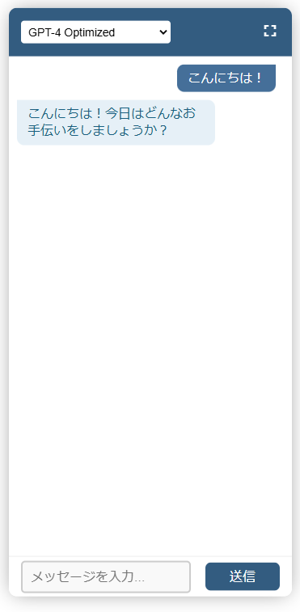
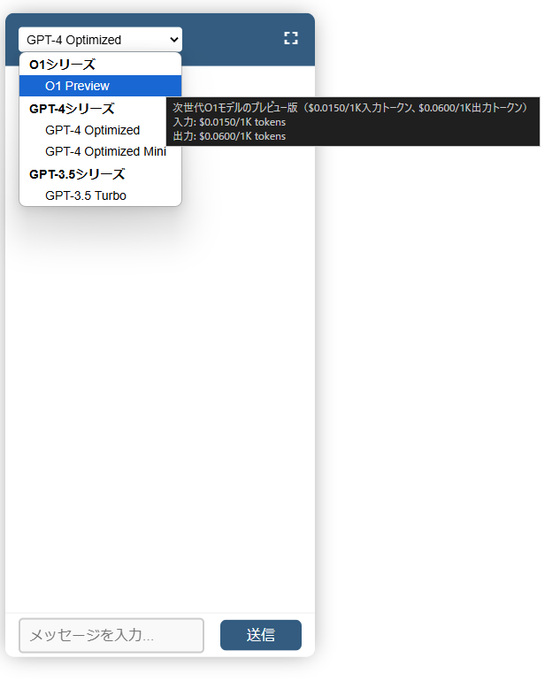

# TypeScript Chatbot

このプロジェクトは、OpenAI APIを活用したインタラクティブなチャットボットアプリケーションです。TypeScriptとReactを使用して構築され、マークダウン形式でのリッチテキスト応答をサポートしています。



## 主な機能

- OpenAI APIを活用したインテリジェントな応答
- 複数のGPTモデル対応（gpt-4o, gpt-4o-mini, gpt-3.5-turbo）
  
- マークダウン形式でのリッチテキスト表示
- レスポンシブデザイン（ウィンドウサイズ切り替え対応）
- リアルタイムのローディング表示
- 自動スクロールによる快適な会話体験

## システム要件

- Node.js (v14以上)
- npm または yarn
- OpenAI APIキー

## インストール方法

1. リポジトリをクローン:
```bash
git clone https://github.com/[your-username]/chatbot.git
cd chatbot
```

2. 依存関係のインストール:
```bash
npm install
```

3. 環境変数の設定:
- `.env.example`をコピーして`.env`を作成
- OpenAI APIキーを設定
```bash
cp .env.example .env
```

## 開発サーバーの起動

開発サーバーを起動するには以下のコマンドを使用します：

```bash
npm start
```

アプリケーションは http://localhost:8080 で起動します。

## ビルド方法

本番環境用のビルドを作成するには:

```bash
npm run build
```

ビルドされたファイルは`dist`ディレクトリに出力されます。

## プロジェクト構造

```
/
├── dist/             # ビルド出力ディレクトリ
├── docs/             # ドキュメント関連ファイル
│   └── images/       # スクリーンショットなどの画像
├── src/              # ソースコードディレクトリ
│   ├── index.tsx     # Reactアプリケーションのエントリーポイント
│   ├── components/   # Reactコンポーネント
│   │   └── Chatbot.tsx  # チャットボットメインコンポーネント
│   ├── config/      # 設定ファイル
│   │   └── models.ts   # モデル設定
│   └── styles/       # コンポーネント固有のスタイル
│       └── Chatbot.css  # チャットボットのスタイル
├── .env.example      # 環境変数テンプレート
├── .env             # 環境変数（非公開）
├── .gitignore       # Git除外設定
├── package.json     # プロジェクト設定・依存関係
├── package-lock.json # 依存関係のロックファイル
├── README.md        # プロジェクト説明
├── requirements.md  # 要件定義
├── tsconfig.json    # TypeScript設定
└── webpack.config.js # Webpack設定
```

## 技術スタック

- TypeScript
- React
- Webpack
- CSS Modules
- Axios
- Marked（マークダウンパーサー）

## 機能詳細

### UI構成
- ヘッダー：モデル選択、ウィンドウサイズ制御
- メイン：チャット履歴表示（マークダウン対応）
- フッター：メッセージ入力、送信制御

### 操作性
- Enterキーでのメッセージ送信
- 自動スクロールによる最新メッセージの表示
- ローディング状態の視覚的フィードバック

## 今後の拡張予定

- チャット履歴の永続化
- プロンプトテンプレート機能
- ファイル添付機能
- 会話コンテキストの保持機能の強化

## ライセンス

ISC

## 貢献について

プルリクエストは大歓迎です。大きな変更を加える場合は、まずissueを作成して変更内容を議論しましょう。

## セキュリティ

- APIキーは`.env`ファイルで管理し、GitHubにはコミットしないでください
- 本番環境では適切な環境変数管理を行ってください 